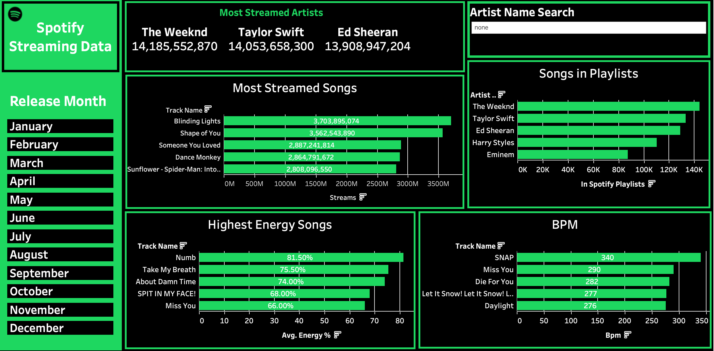

# Tableau Dashboard - Spotify Streaming Data



The purpose of this dashboard is to allow users to delve deeper into the data behind almost 1000 of Spotify's most streamed songs. The dashboard is built around a dataset downloaded from Kaggle, titled: 'Spotify Most Streamed Songs'. This file can be found above in the repository. 

## I have included visuals on the following variables:

- Most Streamed Artists
- Most Streamed Songs
- Highest Energy Songs
- BPM (Beats per Minute)
- Number of Times Artist is Featured in Playlists

## I have also included filters on the page to help narrow your search. These include:

- Release Month
- Artist Name Search Bar

## I created the following calculated fields that are used in many of the visuals:

- J - Monthly Top 5 Streams
- J - Monthly Top 5 BPM
- J - Monthly Top 5 Energy
- J - Monthly Top 5 Playlists
- Name Search

## Please read on to find detailed explanations of how I put together different aspects of this dashboard:

# Release Month Buttons


To create the Release Month buttons filter, I moved 'Release Month' into rows and changed it's type to continuous. 

I typed '1' into columns and changed the measure to minimum, assigning all the bars the same length. 

I  selected 'Entire View' from the view dropdown menu so that the bars vertically filled the sheet. 

I then edited the x-axis, selecting a fixed range with the fixed end set to 1. This was to make the bars take up the horizontal length of the sheet. 

Next, I hid the axis titles and dragged  'Release Month' onto label, labelling each button with a month.

Finally, I added the sheet to my dashboard and selected 'use as filter'. In this way when a month is selected the other visuals will adjust accordingly.

#  Name Search


# Most Streamed Artists


To create the 'Most Streamed Artists' visual at the top of the dashboard, I moved 'Artist Name' into columns and dragged 'Streams' into tooltips before changing its measure to SUM. I then created some filters for this sheet.

J - Monthly Top 5 Streams:   
```
RANK_UNIQUE(SUM([Streams]), 'desc')
```

This calculated field ranks all the artists in the dataset by the sum of their total streams and then orders them in descending order. In this way the artists with the most streams are shown at the top. I then moveed this field into the filter tab and selcted 'At Most: 3' in order to show on the top 3 artists.

Name Search: 

```
IF ISNULL([Artist Name Search]) OR [Artist Name Search] = "none" THEN TRUE
ELSE
  CONTAINS(LOWER([Artist Name]), LOWER([Artist Name Search]))
END
```

This calculated field specifies that if the search bar is empty or the word 'none'is typed, then it will be set to TRUE meaning that no filter will be applied and all available data will be shown. LOWER([Artist Name Search]) then converts whatever is typed into the search bar into lowercase. the CONTAINS clause then compares this to the artist name column, which has also been converted to lower case, and if it finds a match it will filter the dashboard by that artist's name.

# Most Streamed Songs


To create this bar chart I dragged 'Track Name' into rows and added 'Streams' into the rows, changing the measure to SUM.

I then once again moved 2 of my calculated fields into the 'filters' tab. These were:

- J - Monthly Top  5 Streams
- Name Search

Both of these codes are discussed above.

#  Highest Energy Songs


# BPM (Beats per Minute)


# Number of Times Artist is Featured in Playlists


# Things that could be improved

Whilst the dataset did include a large range of 'release years' for different tracks, going back all the way to 1930, 90% of all the tracks included were released in the last 10 years. For this reason it made less sense to include using 'release year' as a filter, because the amount of data from the majority of the years was very limited.

The dataset did not actually specify over what time period these results were collected. I have made the assumption that this data is based on all available data (up until mid-2024).

The dataset did not have a column for 'genre' which would have been a useful and interesting variable to analyse in this context. In any future analysis I would look to find data that included this as a column.
